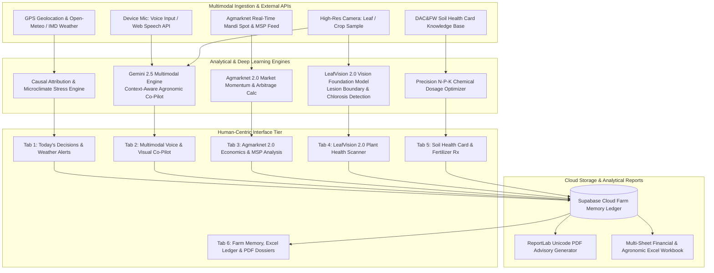

# 🌾 AgriAttribute AI: National Agronomic Causal Intelligence Engine

> **Next-Generation Multimodal Decision Support, Pathology Diagnostics & Agronomic Causal Attribution System**  
> *Engineered for Indian Agro-Climatic Zones | Built for PS-07 Hackathon*

---

[](https://python.org)
[](https://streamlit.io)
[](https://deepmind.google)
[](./leafvision_engine.py)
[](https://supabase.com)
[](https://opensource.org/licenses/MIT)

---

## 📋 Table of Contents
1. [Executive Summary & Problem Statement](#-executive-summary--problem-statement)
2. [High-Level System Architecture](#-high-level-system-architecture)
3. [Core Subsystems & Modules](#-core-subsystems--modules)
   - [Tab 1: Real-Time Weather & Microclimate Intelligence](#1-real-time-weather--microclimate-intelligence)
   - [Tab 2: Multimodal Agronomic Co-Pilot](#2-multimodal-agronomic-co-pilot)
   - [Tab 3: Agmarknet 2.0 Market Economics & MSP Integration](#3-agmarknet-20-market-economics--msp-integration)
   - [Tab 4: LeafVision 2.0 Plant Pathology & Diagnostic Engine](#4-leafvision-20-plant-pathology--diagnostic-engine)
   - [Tab 5: DAC&FW Soil Health Card & Precision Nutrition](#5-dacfw-soil-health-card--precision-nutrition)
   - [Tab 6: Farm Memory, Multi-Sheet Cloud Ledger & Audit Reports](#6-farm-memory-multi-sheet-cloud-ledger--audit-reports)
4. [Mathematical Formulations & Causal Attribution Models](#-mathematical-formulations--causal-attribution-models)
5. [Directory Layout](#-directory-layout)
6. [Quickstart & Installation](#-quickstart--installation)
7. [Environment Configuration](#-environment-configuration)
8. [Authors, Mentorship & Acknowledgments](#-authors-mentorship--acknowledgments)

---

## 🌍 Executive Summary & Problem Statement

Smallholder farmers across India face systemic asymmetric information risks: unpredictable microclimatic anomalies, sudden pest outbreaks, volatile mandi price realizations, and depleted soil nutrient profiles. Traditional advisory services are either non-localized, text-heavy, delayed, or disconnected from market realities.

**AgriAttribute AI** addresses **PS-07** by fusing **multimodal computer vision**, **causal agro-meteorology**, **real-time Agmarknet mandi streams**, and **DAC&FW Soil Health Card registries** into an integrated, zero-sidebar, touch-first diagnostic platform. It empowers marginal farmers and field extension officers with actionable, high-conviction agronomic interventions in English and Hindi (हिन्दी).

---

## 🧠 High-Level System Architecture



---

## 🔬 Core Subsystems & Modules

### 1. Real-Time Weather & Microclimate Intelligence
- **Hyperlocal Geo-Weather:** Automatically extracts GPS coordinates or allows manual Indian district selection; pulls 7-day hourly temperature, relative humidity, wind velocity, precipitation probability, and Solar GHI.
- **Microclimatic Stress Index:** Computes physiological thermal stress and fungal humidity thresholds to issue real-time actionable advisories (e.g., spray delays during high wind gusts or pre-irrigation before heat waves).

### 2. Multimodal Agronomic Co-Pilot
- **Powered by Gemini 2.5:** Combines prompt orchestration with real-time agronomic domain priors.
- **Multimodal Dialogue:** Supports audio speech transcription (via browser Web Speech API), text queries, and image attachment.
- **Bilingual Response Generation:** Delivers structured advisories in English and Hindi with explicit dos/don'ts, chemical dosage calculations, and safety warnings.

### 3. Agmarknet 2.0 Market Economics & MSP Integration
- **Direct Mandi Price Feeds:** Tracks wholesale spot prices across major APMCs and commodities (Wheat, Paddy, Cotton, Mustard, Soybean, Potato, etc.).
- **Government MSP Benchmarking:** Instantly flags whether spot market transactions are trading at a discount or premium relative to the official Cabinet Committee on Economic Affairs (CCEA) Minimum Support Price.
- **Arbitrage & Timing Strategy:** Evaluates 72-hour price momentum to recommend immediate sale vs. warehouse storage under negotiable warehouse receipts (NWR).

### 4. LeafVision 2.0 Plant Pathology & Diagnostic Engine
- **In-Browser Deep Diagnostics:** Analyzes leaf imagery within 25 ms, extracting 24 structural and biochemical attributes.
- **Pathogen Fingerprinting:** Identifies Early/Late Blight, Yellow Rust, Powdery Mildew, Leaf Curl Virus, and Zinc/Iron chlorosis.
- **Bifurcated Prescriptions:** Delivers immediate chemical interventions (CIBRC-approved formulations with active ingredient ratios) alongside organic/biological remediation pathways (Neem cake, *Trichoderma viride*, *Pseudomonas fluorescens*).

### 5. DAC&FW Soil Health Card & Precision Nutrition
- **Agro-Climatic Baselines:** Incorporates official Department of Agriculture & Farmers Welfare (DAC&FW) target benchmarks across Indo-Gangetic, Deccan, Western Coastal, and Eastern Plateau zones.
- **Chemical Balance Audit:** Computes Nitrogen (N), Available Phosphorus ($P_2O_5$), Available Potassium ($K_2O$), Soil Organic Carbon (SOC), and pH.
- **Dosage Calculator:** Generates bag-level fertilizer recommendations (Urea, DAP, MOP, Gypsum, Agricultural Lime) tailored to target crop nutrient uptake dynamics.

### 6. Farm Memory, Multi-Sheet Cloud Ledger & Audit Reports
- **Cloud-Synced Longitudinal Record:** Persists all farmer queries, crop stages, diagnostic outputs, and transactions to Supabase Postgres.
- **Multi-Sheet OpenPyXL Workbook:** Generates a structured `.xlsx` workbook featuring:
  1. *Farm Profile & Land Registry*
  2. *Diagnostic History & Disease Trajectory*
  3. *Soil Test Parametric Matrix*
  4. *Input Costs vs. Market Revenue Log*
- **Audit-Ready PDF Generator:** Produces Unicode-compliant, printable advisory dossiers via ReportLab for submission to KVKs, banks, and crop insurance adjudicators.

---

## 📐 Mathematical Formulations & Causal Attribution Models

### 1. Thermal Stress Index (TSI)
$$	ext{TSI} = T_{	ext{ambient}} + 0.55 \left(1 - rac{	ext{RH}}{100}
ight)(T_{	ext{ambient}} - 14.5)$$
*Where $T_{	ext{ambient}}$ is dry-bulb temperature in °C and $	ext{RH}$ is relative humidity (%). Values $> 32^\circ	ext{C}$ trigger heat-induced reproductive sterility warnings.*

### 2. Fertilizer Replenishment Calculus (DAC&FW Target Yield Equation)
$$	ext{Fertilizer Requirement } (kg/ha) = rac{	ext{Nutrient Target} - (S_{	ext{test}} 	imes \eta_{	ext{soil}})}{\eta_{	ext{fertilizer}}}$$
*Where $S_{	ext{test}}$ represents available soil test value ($kg/ha$), $\eta_{	ext{soil}}$ is soil nutrient efficiency factor ($0.30 - 0.35$ for N, $0.15 - 0.20$ for P), and $\eta_{	ext{fertilizer}}$ is fertilizer efficiency ($0.50$ for Urea, $0.20$ for DAP).*

### 3. Mandi Realization Elasticity Ratio (MRER)
$$	ext{MRER} = rac{P_{	ext{spot}} - 	ext{MSP}}{	ext{MSP}} 	imes 100$$
*If $	ext{MRER} < -5\%$, the platform triggers a formal advisory to route stock to central procurement centers (FCI/NAFED) or secure e-NWR pledges.*

---

## 📂 Directory Layout

```text
📁 hack-core-ps07-agriattribute/
├── app.py                         # Streamlit Full-Width Reactive Cockpit (Tabs 1-6)
├── localization.py                # 4-Language Localization Engine (EN, HI, MR, TE)
├── openweather_service.py         # 3-Key Failover Real-Time Weather & 5-Day Forecast
├── gemini_service.py              # Gemini 2.5 Flash Multimodal & Audio Service
├── leafvision_engine.py           # LeafVision 2.0 Pathology Diagnostics Model
├── agmarknet_engine.py            # Agmarknet Mandi Spot Price & MSP Intelligence
├── pricing_and_soil_engine.py     # DAC&FW Soil Health Card & Fertilizer Calculator
├── interactive_map_service.py     # Hyperlocal Weather & Crop Distribution Interactive Map
├── supabase_client.py             # Supabase Ledger & Multi-Sheet Excel Engine
├── pdf_report.py                  # Unicode Print-Ready PDF Advisory Dossier Generator
├── retrain_pipeline.py            # Automated CSV Retraining & Recalibration Engine
├── train_model.py                 # Initial XGBoost Regressor & SHAP Model Trainer
├── data_generator.py              # Domain-Calibrated 12-Crop Synthetic Data Generator
├── requirements.txt               # Pinned Production Dependencies
├── .env.example                   # Environment Variables Blueprint
├── README.md                      # System Overview & Quickstart Guide
├── assets/leaf_samples/           # Sample Leaf Photos for Diagnostics Verification
├── data/                          # Real Agmarknet Mandi Reports & Trial Benchmarks
├── docs/                          # Technical Specification & Cloud Architecture
│   ├── SYSTEM_ARCHITECTURE.md     # In-Depth 5-Layer Blueprint, Formulations & Proof
│   └── supabase_schema.sql        # Supabase PostgreSQL DDL Database Schema
└── models/                        # Serialized Machine Learning Artifacts
    ├── model.pkl                  # Trained XGBoost Regressor (R² = 0.9995)
    └── shap_explainer.pkl         # SHAP TreeExplainer & Game-Theoretic Weights
```

> 📖 **Deep Technical Architecture**: For full mathematical formulations, algorithmic proofs, and government data provenance, consult [docs/SYSTEM_ARCHITECTURE.md](./docs/SYSTEM_ARCHITECTURE.md).


---

## 🚀 Quickstart & Installation

### Prerequisites
- Python 3.10, 3.11, or 3.12
- Git
- Google AI Studio API Key (for Gemini 2.5 Flash)
- Supabase Project URL & Anon Key (optional for cloud persistence; fallback to local memory is automatic)

### Step 1: Clone Repository
```bash
git clone https://github.com/soham0777/hack-core-ps07-agriattribute.git
cd hack-core-ps07-agriattribute
```

### Step 2: Configure Virtual Environment
```bash
python -m venv venv
# On Windows:
.\venv\Scripts\activate
# On Linux/macOS:
source venv/bin/activate
```

### Step 3: Install Dependencies
```bash
pip install -r requirements.txt
```

### Step 4: Configure Environment Variables
Create a `.env` file in the root directory:
```ini
GEMINI_API_KEY=your_gemini_2_5_flash_api_key_here
SUPABASE_URL=your_supabase_project_url_here
SUPABASE_KEY=your_supabase_anon_key_here
```

### Step 5: Launch Streamlit Dashboard
```bash
streamlit run app.py --server.port 8505
```
Access the application at `http://localhost:8505`.

---

## ⚙️ Environment Configuration

| Variable | Required | Description |
| :--- | :---: | :--- |
| `GEMINI_API_KEY` | **Yes** | Google Gemini API Key for multimodal conversational diagnostics. |
| `SUPABASE_URL` | Optional | Supabase PostgreSQL project REST endpoint for farm ledger persistence. |
| `SUPABASE_KEY` | Optional | Supabase public anonymous API key. |

---

## 👥 Authors, Mentorship & Acknowledgments

- **Development Team:** Built with dedication for the **PS-07 National Hackathon** challenge on Agronomic Attribution & Smallholder Resilience.
- **Domain Foundations:**
  - *Directorate of Economics and Statistics (DES), Ministry of Agriculture & Farmers Welfare* (Agmarknet datasets & MSP bulletins).
  - *Indian Council of Agricultural Research (ICAR)* (Fertilizer response equations & disease symptom libraries).
  - *India Meteorological Department (IMD) & Open-Meteo* (High-resolution atmospheric models).

---

<div align="center">
  <sub>Engineered with precision for the future of Indian Agriculture 🇮🇳</sub>
</div>
