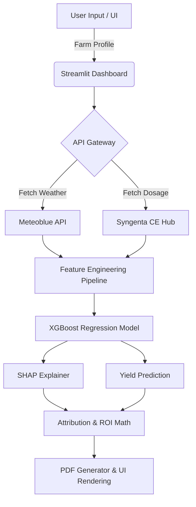

<div align="center">
  
  # 🌾 AgriAttribute AI India
  **HACK CORE 2026 - Problem Statement 07: Yield Attribution & ROI Predictor**
  
  [](https://python.org)
  [](https://streamlit.io)
  [](#)
  [](https://opensource.org/licenses/MIT)

  *Built by **Team 15** for Syngenta Biologicals & ANNAM.AI*

</div>

---

## 🎯 The Vision: “Know the Yield. Prove the Impact.”
Farmers often struggle to differentiate the yield boost provided by biological products from natural factors like good monsoon rains or rich soil. **AgriAttribute AI** solves this by using advanced Machine Learning (XGBoost + SHAP) and live satellite weather data to mathematically isolate and prove the exact ROI generated by Syngenta Biologicals.

We built a platform that translates complex data science into a **"Farmer-First"** experience—allowing farmers to see their financial gains in their native language, download PDF reports, and share results via WhatsApp.

---


## Problem Addressed
Farmers struggle to determine how much of their crop yield improvement is actually attributable to the use of biological products, versus improvements caused by confounding factors such as weather, soil quality, temperature, and farming practices. This lack of clear attribution makes it difficult for farmers to understand the true value and ROI of biological products, reducing their confidence in adopting and reinvesting in them.
---

## ✨ Key Features & Innovation

*   **🚜 Farmer-Centric Abstraction:** Complex variables (GDD, SOC, NDVI) are abstracted into intuitive dropdowns ("Soil Quality", "Monsoon Rain") for non-technical users, while an "Agronomist Mode" remains available for experts.
*   **🌍 Multi-Lingual Native Support:** Full localized support for **English, Hindi, Marathi, and Telugu**, catering directly to Indian farmers across diverse agro-climatic zones.
*   **🌦️ Live Meteoblue Integration:** Fetches live 10-day agronomic weather forecasts and historical telemetry (Rainfall, Heat Stress) using the Meteoblue API.
*   **📊 SHAP Yield Attribution:** Decomposes the final crop yield into specific attribution percentages: *Syngenta Biological vs. Weather vs. Soil vs. Baseline*.
*   **📥 1-Click PDF Reports:** Generates branded, ready-to-print A4 PDF reports detailing the farm profile, ROI financials, and weather forecasts.
*   **📲 WhatsApp ROI Sharing:** Generates a pre-framed, emoji-rich summary of the farmer's net profit and yield boost for instant sharing via WhatsApp.

---

## 🏗️ Technical Architecture



---

## 🚀 Quick Start Guide

### 1. Clone the Repository
```bash
git clone https://github.com/soham0777/hack-core-ps07-agriattribute.git
cd hack-core-ps07-agriattribute
```

### 2. Install Dependencies
Ensure you have Python 3.9+ installed.
```bash
pip install -r requirements.txt
```

### 3. Run the Platform
```bash
streamlit run app.py
```
The application will launch automatically in your browser at `http://localhost:8505`.

---

## 📁 Repository Structure

```text
hack_core_ps07/
├── app.py                  # Main Streamlit Dashboard (UI & Logic)
├── data_generator.py       # API Hooks (Meteoblue, CE Hub) & Synthetic Data
├── pdf_report.py           # FPDF2 engine for A4 Report Generation
├── train_model.py          # XGBoost Model training & SHAP compilation
├── requirements.txt        # Python dependencies
├── README.md               # You are here!
└── concept_note.md         # Formal Hackathon Concept Submission
```

---

## 🏆 Team 15

*   **Soham Prabhakar Kadu** (Team Lead)
*   **Singireddy Prabhumitrareddy**
*   **Bhakti Ajay Kadam**

*Special thanks to our mentors: Dr. Shahbaz (ANNAM.AI) and Hana Hafer (Syngenta).*
