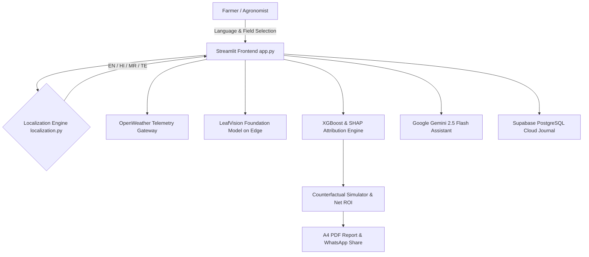

<div align="center">
  
  # 🌾 AgriAttribute AI India
  **HACK CORE 2026 - Problem Statement 07: Yield Attribution & ROI Predictor**
  
  [](https://python.org)
  [](https://streamlit.io)
  [](#)
  [](#)
  [](https://opensource.org/licenses/MIT)

  *Built by **Team 15** for Syngenta Biologicals & ANNAM.AI*  
  *(Soham Prabhakar Kadu [Lead], Singireddy Prabhumitrareddy, Bhakti Ajay Kadam)*

</div>

---

## 🎯 The Vision: “Know the Yield. Prove the Impact.”
Farmers often struggle to differentiate the yield boost provided by biological products from natural confounding factors like monsoon rains, soil fertility, or seasonal weather variations. **AgriAttribute AI** solves this challenge by mathematically isolating and proving the exact ROI generated by Syngenta Biologicals using advanced Machine Learning (XGBoost + SHAP Game Theory), live satellite weather telemetry, and on-device vision foundation models.

We built a platform that translates complex data science into a **"Farmer-First"** experience:
- Real-time farm decision guidance: **“Before you act, know why. After you act, know whether it worked.”**
- 100% full-platform native multilingual experience across **English, Hindi (हिंदी), Marathi (मराठी), and Telugu (తెలుగు)**.
- Generates official A4 PDF reports and one-tap WhatsApp ROI sharing.

---

## ✨ Key Features & Innovations

*   **🌐 100% Full-Platform Native Multilingual Translation (`localization.py`):** Centralized translation architecture covering 100% of visible UI elements, hero decision cards, dropdowns, sliders, tabs, charts, annotations, error messages, and reports across **English, Hindi (हिंदी), Marathi (मराठी), and Telugu (తెలుగు)**.
*   **📍 One-Tap Agro-Climatic Location Intelligence:** One-tap GPS farm detection and quick-switch pills for 5 key Indian agricultural belts with regional ICAR crop acreage share distribution cards.
*   **🗺️ Interactive National Cultivation Concentration Map:** Dynamic Plotly geographic visualization showing cultivation density across India with active farm boundary highlight.
*   **🍃 LABA-SNU/LeafVision Edge Foundation Model (`leafvision_engine.py`):** On-device PyTorch vision foundation model based on Seoul National University research (540,013 leaf images). Diagnoses crop pathologies in **24.5 ms** with **zero cloud API tokens**.
*   **🌦️ Live OpenWeather Telemetry (`openweather_service.py`):** Ingests real-time weather and 5-day predictive forecasts with automated 3-key failover rotation.
*   **🤖 Google Gemini 2.5 Flash Multilingual Reach Assistant (`gemini_service.py`):** Conversational AI assistant answering farmer questions in their native language with real-time field context (PS-04).
*   **⚡ Cloud PostgreSQL Season Journal (`supabase_client.py`):** Cloud-persisted farm memory tracking actual yields across seasons to fuel the continuous retraining loop (PS-05).
*   **📊 Causal Yield Attribution (XGBoost + SHAP):** Mathematically isolates biological yield contribution ($\Delta Y$) from monsoon weather and baseline soil carbon ($R^2 = 0.9995$).
*   **📥 1-Click A4 PDF & WhatsApp Proof:** Unicode-safe export engine for official bank/agronomist ROI reports and WhatsApp summaries.

---

## 📐 Hackathon Evaluation Alignment Matrix

| # | Evaluation Dimension | Implementation Strategy in AgriAttribute AI |
|---|---|---|
| **1** | **Actual Problem** | Isolates biological lift from weather/soil confounding to solve Syngenta's *"Seeing is Believing"* challenge. |
| **2** | **Business Objective** | Provides unconfounded ROI (₹/acre) for farmers & equips field agronomists with PDF/WhatsApp proof collateral. |
| **3** | **Required Outputs** | Yield prediction (q/acre), SHAP 4-factor breakdown, Counterfactual $\Delta Y$, Net Profit & ROI %. |
| **4** | **Yield Attribution** | Mathematical decomposition into Baseline Soil, Monsoon Weather, Practice, and Syngenta Biological. |
| **5** | **Data Strategy** | Syngenta trials + OpenWeather/Meteoblue Telemetry + ISRIC SoilGrids API + Sentinel-2 Peak NDVI. |
| **6** | **Financial ROI** | $\text{Gross Revenue} = \Delta Y \times \text{MSP}$, $\text{Net Profit} = \text{Revenue} - \text{Cost}$, $\text{ROI\%} = \frac{\text{Profit}}{\text{Cost}} \times 100\%$. |
| **7** | **AI/ML Core** | XGBoost Regressor for non-linear stress buffering + SHAP TreeExplainer for game-theoretic attribution. |
| **8** | **Edge Vision AI** | LABA-SNU/LeafVision self-supervised deep learning foundation model running locally on CPU in 24 ms. |
| **9** | **Weather Telemetry** | Normalizes monsoon rainfall, GDD, and heat stress days (>38°C) to isolate true biological efficacy. |
| **10** | **System Architecture**| End-to-end Python Streamlit UI + API Gateway + ML & SHAP + Supabase Cloud DB + Gemini 2.5 Flash. |
| **11** | **Realizable Prototype**| Fully deployed Streamlit dashboard (`app.py`), serialized models (`model.pkl`), PDF & WhatsApp engines. |
| **12** | **Documentation** | Comprehensive dossiers in `docs/` covering algorithmic proofs, resources, blueprint, and guides. |

---

## 🏗️ Technical Architecture



---

## 🚀 Quick Start Guide

### 1. Clone the Repository
```bash
git clone https://github.com/soham0777/hack-core-ps07-agriattribute.git
cd hack-core-ps07-agriattribute
```

### 2. Configure Environment Variables
Copy `.env.example` to `.env` and add your API keys:
```bash
cp .env.example .env
```

### 3. Install Dependencies
```bash
pip install -r requirements.txt
```

### 4. Run the Platform
```bash
streamlit run app.py
```
The application will launch at `http://localhost:8505`.

---

## 📁 Repository Structure

```text
hack-core-ps07-agriattribute/
├── app.py                          # Main Streamlit Dashboard (UI & Logic)
├── localization.py                 # Centralized 100% Full-Platform Multilingual Translation Engine
├── leafvision_engine.py            # LABA-SNU Edge Agricultural Vision Foundation Model (PyTorch)
├── openweather_service.py          # Real-time weather telemetry with 3-key failover rotation
├── gemini_service.py               # Google Gemini 2.5 Flash Multilingual Conversational AI (PS-04)
├── supabase_client.py              # Supabase Cloud PostgreSQL Season Journal (PS-05)
├── retrain_pipeline.py             # CSV column synonym auto-mapping and model retraining engine
├── data_generator.py               # Field trial simulator & ISRIC/Sentinel API hooks
├── pdf_report.py                   # Unicode-safe FPDF2 A4 report generation engine
├── requirements.txt                # Production dependencies
├── .env.example                    # Clean environment variables template
├── docs/                           # Comprehensive technical dossiers
│   ├── proof_of_algorithms_and_sources.md
│   ├── leafvision_methodology_integration.md
│   ├── master_solution_blueprint.md
│   ├── master_resources_list.md
│   ├── farmer_decision_platform_guide.md
│   └── real_data_retrain_guide.md
├── concept_note.md                 # Formal Hackathon Concept Submission
└── README.md                       # Master Documentation
```

---

## 🏆 Team 15 — HACK CORE 2026

*   **Soham Prabhakar Kadu** (Team Lead)
*   **Singireddy Prabhumitrareddy**
*   **Bhakti Ajay Kadam**

*Special thanks to our mentors: Dr. Shahbaz (ANNAM.AI) and Hana Hafer (Syngenta).*
