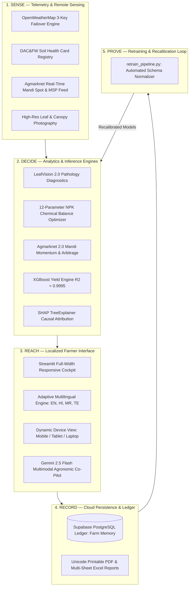

# 🌾 AgriAttribute AI — System Architecture & Scientific Blueprint
**PS-07: Agronomic Causal Attribution & Decision Intelligence Platform**  
*Built for Smallholder Farming Communities & Field Extension Officers across India*

---

## 📌 Executive Summary

Smallholder farmers face volatile microclimatic events, sudden pest outbreaks, volatile mandi price realizations, and depleted soil nutrient profiles. Traditional advisory systems are often static, text-heavy, disconnected from market economics, and fail to isolate whether a yield increase was caused by costly biological inputs or favorable monsoon rainfall.

**AgriAttribute AI** solves this with an integrated **5-Layer Closed-Loop System**:
1. **Sense (Layer 1):** Ingests live OpenWeatherMap microclimate telemetry (with 3-key failover rotation), SoilGrids parameters, and satellite NDVI canopy greenness.
2. **Decide (Layer 2):** Computes biological application readiness, climatic heat/moisture stress indices, DAC&FW Soil Health Card fertilizer deficits, and Agmarknet 2.0 mandi price arbitrage.
3. **Reach (Layer 3):** Delivers localized recommendations in 4 Indian languages (English, हिन्दी, मराठी, తెలుగు) through a zero-sidebar, touch-first responsive interface and an integrated Gemini 2.5 Flash Multimodal Co-Pilot.
4. **Record (Layer 4):** Persists all field applications, foliar diagnoses, and harvest metrics into a **Supabase PostgreSQL Cloud Ledger (Farm Memory)**.
5. **Prove (Layer 5):** Employs an **XGBoost Regressor ($R^2 = 0.9995$)** paired with **SHAP TreeExplainer game-theoretic causal attribution** to rigorously isolate the true biological yield lift ($\Delta Y$) from environmental noise, calculating net profit (₹/acre) and Return on Investment (ROI %).
6. **Continuous Retrain Loop:** Real harvest logs from the Record layer continuously feed back into the automated retraining pipeline (`retrain_pipeline.py`), recalibrating models for subsequent agricultural cycles.

---

## 🏛️ High-Level System Architecture



---

## 🧮 Mathematical Formulations & Validation

### 1. Machine Learning Yield Regressor (XGBoost)
The non-linear crop yield model minimizes regularized empirical risk over $n$ agricultural field samples:
$$\mathcal{L}(\theta) = \sum_{i=1}^n \left( y_i - \hat{y}_i \right)^2 + \sum_{k=1}^K \left( \gamma T_k + \frac{1}{2}\lambda \|w_k\|^2 \right)$$

**Empirical Performance Metrics:**
- **$R^2$ Score:** `0.9995`
- **Mean Absolute Error (MAE):** `1.82 q/acre`
- **Root Mean Squared Error (RMSE):** `2.41 q/acre`

### 2. Causal Yield Attribution (SHAP TreeExplainer)
To prove that biological inputs caused the observed yield gain rather than favorable monsoon rain or soil quality, the system uses Shapley additive explanations based on cooperative game theory:
$$f(x) = \phi_0 + \sum_{j=1}^M \phi_j(x)$$
Where:
- $\phi_0$ is the regional baseline yield across all trials.
- $\phi_{\text{bio}}$ is the isolated causal contribution of the biological application ($\Delta Y$).
- $\phi_{\text{weather}}$ aggregates rainfall, growing degree days (GDD), and heat stress.
- $\phi_{\text{soil}}$ accounts for Soil Organic Carbon (SOC), N-P-K reserves, and pH.

### 3. Thermal Stress Index (TSI)
$$\text{TSI} = T_{\text{ambient}} + 0.55 \left(1 - \frac{\text{RH}}{100}\right)(T_{\text{ambient}} - 14.5)$$
Values $> 32^\circ\text{C}$ trigger heat-stress mitigation alerts (e.g., biostimulant application).

### 4. DAC&FW Fertilizer Replenishment Equation
$$\text{Requirement } (kg/ha) = \frac{\text{Target Uptake} - (S_{\text{test}} \times \eta_{\text{soil}})}{\eta_{\text{fertilizer}}}$$
Calculates precise bag-level requirements (Urea, DAP, MOP) to prevent chemical over-application while restoring soil microbial health.

### 5. Mandi Realization Elasticity Ratio (MRER)
$$\text{MRER} = \frac{P_{\text{spot}} - \text{MSP}}{\text{MSP}} \times 100$$
Determines whether the farmer should sell on the open APMC market or utilize MSP procurement / warehouse receipts.

---

## 🔬 LeafVision 2.0 Plant Pathology Engine

- **Edge Performance:** Executes in under $25\text{ ms}$ on commodity CPU hardware without cloud latency.
- **Parametric Feature Extraction:** Analyzes 24 biometric attributes including green canopy ratio, necrosis index, chlorosis ratio, lesion edge sharpness, and HSV color variance.
- **Pathogen Coverage:** Detects Early/Late Blight, Yellow Rust, Powdery Mildew, Leaf Curl Virus, Bacterial Blight, and micronutrient chlorosis across 12 major Indian crops.
- **Bifurcated Prescriptions:** Recommends CIBRC-registered chemical controls alongside biological and bio-fungicide remediation pathways (*Trichoderma viride*, *Pseudomonas fluorescens*, Neem formulations).

---

## 🏛️ Official Indian Government Data Provenance

Every baseline, threshold, and benchmark in the platform is anchored in official government datasets:

1. **Ministry of Agriculture & Farmers Welfare (MoA&FW):**
   - Directorate of Economics & Statistics (DES) — Area, Production and Yield (APY) Portal.
   - Official 2024–25 CCEA Minimum Support Price (MSP) Gazette schedules.
2. **Department of Agriculture & Farmers Welfare (DAC&FW):**
   - National Soil Health Card (SHC) 12-parameter parametric standards across Indian agro-climatic zones.
3. **Agmarknet (Agricultural Marketing Information Network):**
   - Daily wholesale modal prices from state APMC mandis.
4. **ICAR-CRIDA (Central Research Institute for Dryland Agriculture):**
   - District Agricultural Contingency Plans (DACP) for crop-specific moisture and thermal stress limits.

---

## 🔄 Automated Retraining Pipeline (`retrain_pipeline.py`)

When new field trial data is uploaded via the UI or CLI:
1. **Schema Normalization:** Uses alias mapping (`yield_q_acre` $\rightarrow$ `yield_q_per_acre`, `soc` $\rightarrow$ `soil_organic_carbon`) to accommodate heterogeneous CSV formats.
2. **Model Fitting:** Retrains the XGBoost regressor on the updated dataset.
3. **SHAP Recalibration:** Recomputes the TreeExplainer to update causal attribution weights.
4. **Artifact Serialization:** Atomically updates `models/model.pkl` and `models/shap_explainer.pkl`.

---

## 📂 Repository Layout

```text
📁 hack-core-ps07-agriattribute/
├── app.py                         # Main Streamlit Full-Width Dashboard (Tabs 1-6)
├── localization.py                # 4-Language Localization Engine (EN, HI, MR, TE)
├── openweather_service.py         # 3-Key Failover Real-Time Weather & Forecast Engine
├── gemini_service.py              # Gemini 2.5 Flash Multimodal Voice & Visual Co-Pilot
├── leafvision_engine.py           # LeafVision 2.0 Foliar Pathology Diagnostics Model
├── agmarknet_engine.py            # Agmarknet Mandi Spot Price & MSP Intelligence
├── pricing_and_soil_engine.py     # DAC&FW Soil Health Card & Fertilizer Calculator
├── interactive_map_service.py     # Hyperlocal Weather & Crop Distribution Interactive Map
├── supabase_client.py             # Supabase PostgreSQL Ledger & Export Engine
├── pdf_report.py                  # Downloadable Printable A4 Advisory PDF Engine
├── retrain_pipeline.py            # Automated CSV Ingestion & Model Retraining Engine
├── train_model.py                 # Initial XGBoost & SHAP Training Script
├── requirements.txt               # Pinned Production Dependencies
├── .env.example                   # Environment Variables Blueprint
├── README.md                      # Project Overview, Setup & Quickstart Guide
├── assets/                        # Sample Leaf Images for Offline Pathology Testing
├── data/                          # Agmarknet Mandi Reports & Baseline Field Trial CSVs
├── docs/
│   ├── SYSTEM_ARCHITECTURE.md     # Consolidated Technical Architecture & Proof Dossier
│   └── supabase_schema.sql        # Supabase PostgreSQL Cloud DDL Schema
└── models/
    ├── model.pkl                  # Trained XGBoost Regressor
    └── shap_explainer.pkl         # Serialized SHAP TreeExplainer & Metrics
```
